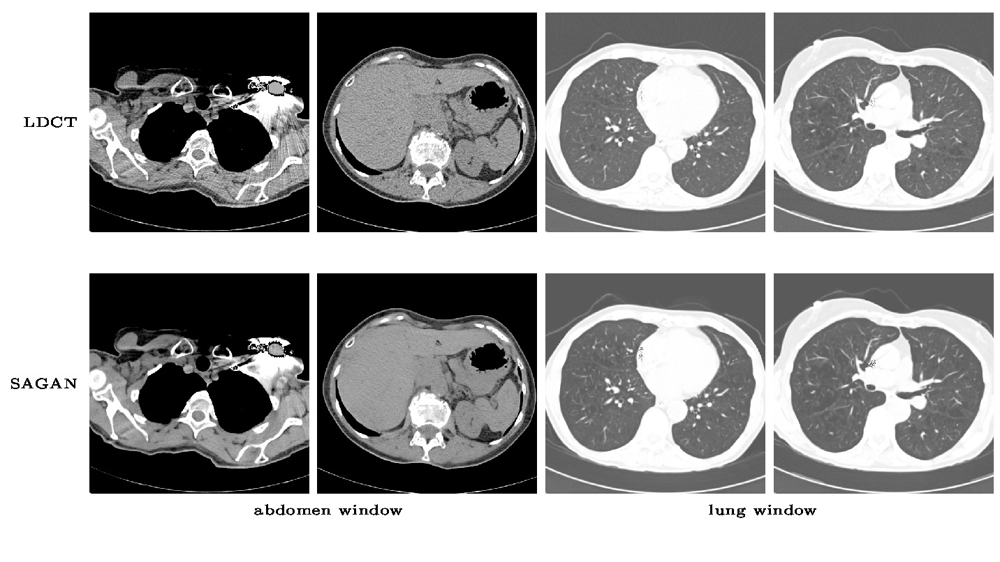

## SAGAN

#### Update 2018.03.27
The piglet dataset we used in the publication is now open for download! Please find the link in my [personal webpage](http://homepage.usask.ca/~xiy525/). (Note: for non-commercial use only)

##
This repo provides the trained denoising model and testing code for low dose CT denoising as described in our [paper](https://link.springer.com/article/10.1007/s10278-018-0056-0).
Here are some randomly picked denoised results on low dose CTs from this [kaggle challenge](https://www.kaggle.com/c/data-science-bowl-2017/data). 


## How to use
To better use this repo, please make sure the dose level of the LDCTs are larger than 0.71 mSv.
### Prerequistites
- Linux or OSX
- NVIDIA GPU
- Python 3.x
- Torch7

### Getting Started
- Install [Torch7](http://torch.ch/docs/getting-started.html#_)
- Install torch packages nngraph and hdf5
```bash
luarocks install nngraph
luarocks install hdf5
```
- Install [Python 3.x](https://www.anaconda.com/download/#macos) (recommend using Anaconda)
- Install python dependencies 
```
pip install -r requirements.txt
```
- Clone this repo:
```bash
git clone git@github.com:xinario/SAGAN.git
cd SAGAN
```


- Download the pretrained denoising model from [here](https://1drv.ms/u/s!Aj4IQl4ug0_9gj4TTqVW1JhhHG5f) and put it into the "checkpoints/SAGAN" folder

- Prepare your test set with the provided python script
```bash
#make a directory inside the root SAGAN folder to store your raw dicoms, e.g. ./dicoms
mkdir dicoms
#then put all your low dose CT images of dicom format into this folder and run
python pre_process.py  --input ./dicoms --output ./datasets/experiment/test
#all your test images would now be saved as uint16 png format inside folder ./datasets/experiment/test. 

```
- Test the model:
```bash
DATA_ROOT=./datasets/experiment name=SAGAN which_direction=AtoB phase=test th test.lua
#the results are saved in ./result/SAGAN/latest_net_G_test/result.h5
```
- Display the result with a specific window, e.g. abdomen. Window type can be changed to 'abdomen', 'bone' or 'none'
```bash
python post_process.py --window 'abdomen'
```
Now you can view the result by open the html file index.html sitting in the root folder

### Citations
If you find it useful and are using the code/model/dataset provided here in a publication, please cite our paper:

Yi, X. & Babyn, P. J Digit Imaging (2018). https://doi.org/10.1007/s10278-018-0056-0


### Acknowlegements
Code borrows heavily from [pix2pix](https://github.com/phillipi/pix2pix)
