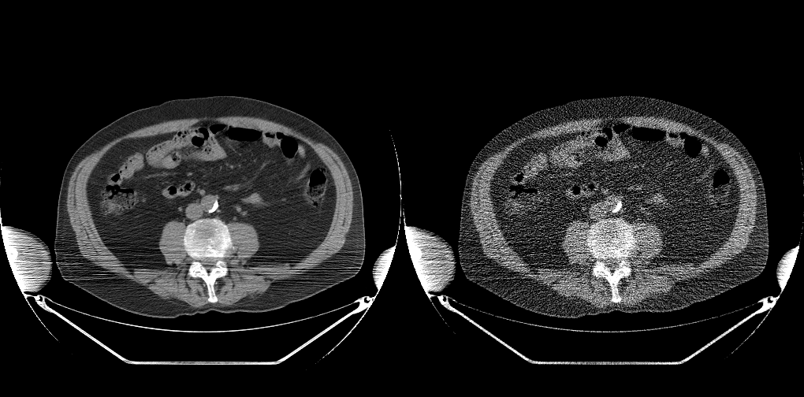

## simulate poisson noise on CT

This repo provides the code to simulate poisson noise on full dose CT as specified in our paper. 

### Prerequistites
- Matlab

Details about how to run the code can be found in demo.m

